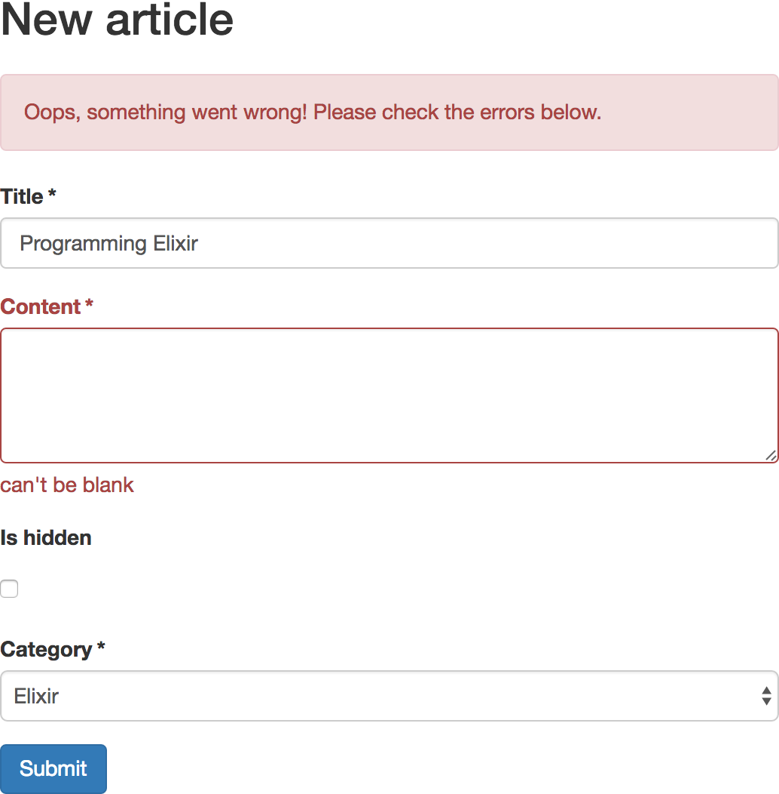

# Formex

Formex is an abstract layer that helps to build forms in Phoenix and Ecto. With this library you
don't write changesets, but create form module with list of fields
(like in [Symfony](https://symfony.com/doc/current/forms.html#creating-form-classes)).
Formex will build changeset and additional Ecto queries (to get options for `<select>`) for itself.
Formex also comes with helper functions for templating.

## Installation
`mix.exs`
```elixir
def deps do
  [{:formex, "~> 0.1.0"}]
end

def application do
  [applications: [:formex]]
end
```

`config/config.exs`
```elixir
config :formex,
  repo: App.Repo,
  translate_error: &App.ErrorHelpers.translate_error/1
```

`web/web.ex`
```elixir
def controller do
  quote do
    import Formex.Builder
  end
end

def view do
  quote do
    import Formex.View
  end
end
```

## Usage

We have models Article and Category:

```elixir
schema "articles" do
  field :title, :string
  field :content, :string
  field :hidden, :boolean

  belongs_to :category, App.Category
end
```

```elixir
schema "categories" do
  field :name, :string
end
```

Let's create a form for Article using Formex:
```elixir
# /web/form/article_form.ex
defmodule App.ArticleForm do
  use Formex.Form

  def build_form( form ) do
    form
    |> add(:text_input, :title, label: "Title")
    |> add(:textarea, :content, label: "Content", phoenix_opts: [
      rows: 4
    ])
    |> add(:checkbox, :hidden, label: "Is hidden", required: false)
    |> add(:select_assoc, :category_id, label: "Category", phoenix_opts: [
      prompt: "Choose category"
    ])
  end
end
```

controller:
```elixir
def new(conn, _params) do
  form = create_form(App.ArticleForm, %Article{})
  render(conn, "new.html", form: form)
end

def create(conn, %{"article" => article_params}) do
  App.ArticleForm
  |> create_form(%Article{}, article_params)
  |> insert_form_data
  |> case do
    {:ok, _article} ->
      conn
      |> put_flash(:info, "Article created successfully.")
      |> redirect(to: article_path(conn, :index))
    {:error, form} ->
      render(conn, "new.html", form: form)
  end
end

def edit(conn, %{"id" => id}) do
  article = Repo.get!(Article, id)
  form = create_form(App.ArticleForm, article)
  render(conn, "edit.html", article: article, form: form)
end

def update(conn, %{"id" => id, "article" => article_params}) do
  article = Repo.get!(Article, id)

  App.ArticleForm
  |> create_form(article, article_params)
  |> update_form_data
  |> case do
    {:ok, article} ->
      conn
      |> put_flash(:info, "Article updated successfully.")
      |> redirect(to: article_path(conn, :show, article))
    {:error, form} ->
      render(conn, "edit.html", article: article, form: form)
  end
end
```

template:
```html+eex
<%= formex_for @form, @action, fn f -> %>

  <%= if @form.changeset.action do %>
    <div class="alert alert-danger">
      <p>Oops, something went wrong! Please check the errors below.</p>
    </div>
  <% end %>

  <%= form_row f, :name %>
  <%= form_row f, :content %>
  <%= form_row f, :category_id %>

  <div class="form-group">
    <%= submit "Submit", class: "btn btn-primary" %>
  </div>

<% end %>
```

CSS (optional):
```css
.required .control-label:after {
  content: '*';
  margin-right: 3px;
}
```

final effect:



It's very simple, isn't it?
You don't need to create any changeset, nor write query to get options for a Category select.

## Advanced

If you need to change something in changeset, there is a callback for that:

```elixir
defmodule App.ArticleForm do
  def changeset_after_create_callback( changeset ) do
    # modify changeset and return it
    changeset
  end
end
```

## Documentation

[https://hexdocs.pm/formex](https://hexdocs.pm/formex)
